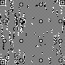

# QR CODE DECODER

QR CODE Version 19 뜯어보기

</img>

## Decoder

- [x] load QR code image
- [x] read QR code image
- [x] get format data from code
- [x] generate mask func
- [x] masking
- [x] read encoding type
- [x] get codewords
- [ ] refine codewords
- [ ] get full data
